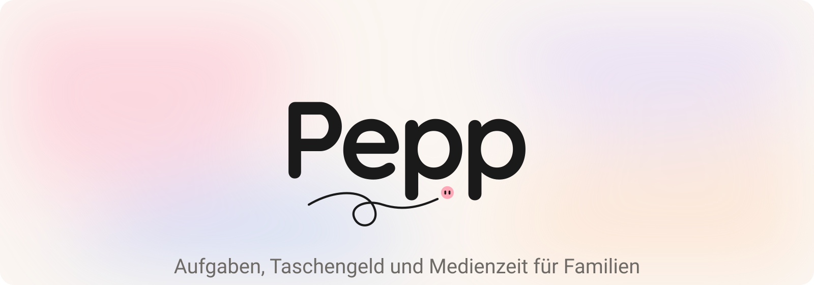
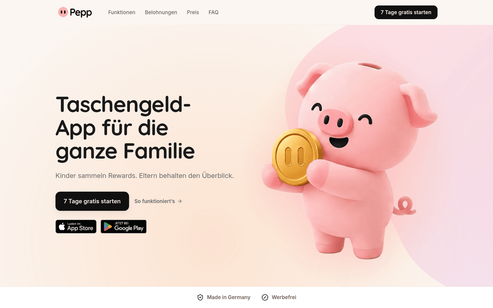
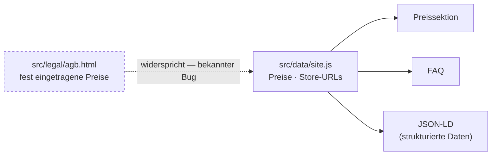

<div align="center">

<picture>
  <source media="(prefers-color-scheme: dark)" srcset="docs/assets/hero-dark.svg">
  <source media="(prefers-color-scheme: light)" srcset="docs/assets/hero-light.svg">
  
</picture>

### Marketing-Landingpage für Pepp

Statische Seite mit einem einzigen Ziel: zum App-Download führen.


</div>

---

> [!IMPORTANT]
> **Die Seite ist fertig gebaut.** Was noch fehlt, ist keine Programmierarbeit mehr, sondern
> **acht Entscheidungen bzw. Lieferungen vom Kunden** — zwei davon blockieren den Livegang
> rechtlich. → [Übergabe](#übergabe--was-noch-offen-ist)

<div align="center">
  
</div>

## Über dieses Projekt

Marketing-Seite für **Pepp**, die deutsche Familien-App für Aufgaben, Taschengeld und Medienzeit.
Kein SPA-Framework, kein Anwendungszustand, keine externen Ressourcen zur Laufzeit — reines
statisches HTML.

Fünf Seiten: die Landingpage mit 15 Sektionen, dazu Impressum, Datenschutz, AGB und
Barrierefreiheitserklärung.

## Schnellstart

```bash
git clone https://github.com/SmVHutchy/pepp-landingpage.git
cd pepp-landingpage
npm install
npm run dev
```

Läuft danach auf <http://localhost:4321>. Mehr braucht es nicht — keine Umgebungsvariablen, keine
`.env` ([Details](docs/ENVIRONMENT.md)).

## Stack

| Was       | Womit                                                         |
| --------- | ------------------------------------------------------------- |
| Generator | Astro 7.2.2, `output: 'static'`                               |
| Sprache   | JavaScript und `.astro`; TypeScript nur für Komponenten-Props |
| Styling   | CSS Custom Properties, keine Utility-Bibliothek               |
| Animation | GSAP 3.12.5 mit ScrollTrigger                                 |
| Bilder    | `astro:assets` mit sharp — PNG wird beim Build zu WebP        |
| Node      | v22.22.3 (siehe `.nvmrc`), npm 10.9.8                         |

## Die wichtigste Regel

**Preise und Store-URLs stehen an genau einer Stelle:** [`src/data/site.js`](src/data/site.js).



Preise also nie an mehreren Stellen gleichzeitig ändern. Die eine Ausnahme ist ein bekannter Bug:
Die AGB in [`src/legal/agb.html`](src/legal/agb.html) tragen eigene Preise, die den zentralen
widersprechen — siehe [Punkt 1](#blockiert-den-livegang).

## Befehle

| Befehl            | Macht                              | Status                               |
| ----------------- | ---------------------------------- | ------------------------------------ |
| `npm run dev`     | Dev-Server auf Port 4321           | ✓                                    |
| `npm run build`   | Baut nach `dist/` (6 Seiten, ~7 s) | ✓                                    |
| `npm run preview` | Serviert den `dist/`-Build lokal   | ✓, siehe [Fallstricke](#fallstricke) |
| `npm run check`   | `astro check` im strict-Modus      | ✓, 0 Fehler                          |
| `npm run format`  | Prettier über das ganze Projekt    | ✓                                    |
| `npm run verify`  | **Abnahme-Prüfung**, 19 Regeln     | ✓ 19/19                              |

### `npm run verify` — vor jedem Commit

Das Qualitätstor des Projekts: 19 harte Regeln — CTA-Disziplin, verbotene Begriffe, Kontrast, genau
eine `<h1>` pro Seite, Bedienbarkeit ohne JavaScript, Reduced Motion, Reflow bei 320 px. Der
Dev-Server muss laufen:

```bash
npm run dev &
node scripts/verify.mjs
```

Stand 17.08.2026: **19 von 19 bestanden.** Jeder neue Fehler danach gehört dir.

<details>
<summary><strong>Weitere Werkzeuge in <code>scripts/</code></strong></summary>

Die Playwright-basierten Skripte brauchen einen laufenden Dev-Server.

| Befehl                                         | Macht                                                                  |
| ---------------------------------------------- | ---------------------------------------------------------------------- |
| `node scripts/verify.mjs`                      | Die Abnahme-Prüfung (siehe oben)                                       |
| `node scripts/shots.mjs [1440\|390\|320]`      | Screenshottet jede Sektion nach `.compare/`                            |
| `node scripts/compare.mjs [sektion]`           | Vergleicht diese Screenshots mit der Design-Referenz                   |
| `node scripts/measure.mjs [--save]`            | Misst Sektionsrhythmus, Höhe und Textmenge gegen die eigene Basislinie |
| `node scripts/palette.mjs [1440\|390\|320]`    | Prüft die Flächenverteilung gegen die 60/30/10-Regel                   |
| `node scripts/freistellen.mjs <quelle> <ziel>` | Stellt gelieferte Renders frei und entsäumt sie                        |

</details>

## Fallstricke

- **Dev-Server hängt sich nach vielen Dateiänderungen auf.** `npm run verify` meldet dann Fehler,
  die der echte Build nicht hat. Abhilfe: neu starten, noch einmal messen.

- **`npm run preview` lauscht nur auf IPv6** (`[::1]`, nicht `127.0.0.1`). Wenn
  `curl http://localhost:4321` leer bleibt, läuft der Server trotzdem:

  ```bash
  curl http://[::1]:4321/
  ```

- **Playwright braucht installierte Browser:** `npx playwright install chromium`.

- **Der Ordner „Pepp Final Design System/" liegt nicht im Repo** — 241 MB Nachschlagewerk, keine
  Build-Abhängigkeit. Wo er liegt: [ARCHITECTURE.md](docs/ARCHITECTURE.md), Begründung in
  [DECISIONS.md](docs/DECISIONS.md) (ADR-002).

---

## Übergabe — was noch offen ist

**Stand: 03.09.2026.**

**Erledigt:** Der CTA-Knopf in der Navigation brach auf dem Handy um und war teilweise unsichtbar.
Die früher fehlenden Standarddateien (og-image, `robots.txt`, `sitemap.xml`, Favicon-Set,
Web-Manifest, 404-Seite) sind jetzt alle da. Pepp in „Der Alltag" überlappte beim Scrollen die
Trustbar — behoben.

**Ohne Kunde offen: nichts.** Alles Folgende braucht eine Entscheidung oder Lieferung von außen.

### Blockiert den Livegang

| #   | Was fehlt                                                                                                                                  | Wer   | Ohne Antwort                                                           |
| --- | ------------------------------------------------------------------------------------------------------------------------------------------ | ----- | ---------------------------------------------------------------------- |
| 1   | **Rechtstext-Widerspruch:** AGB nennen 23,88 €/Jahr + Lifetime 79,99 €, die Preissektion 23,90 €/Jahr ohne Lifetime. Welche Zahlen gelten? | Kunde | Nutzer sieht einen anderen Preis als im Vertrag — rechtlich angreifbar |
| 2   | **Barrierefreiheitserklärung:** Kontaktstelle, Durchsetzungsstelle, Prüfdatum fehlen — stehen als Platzhaltertext live auf der Seite       | Kunde | Verstößt gegen das BFSG                                                |
| 3   | **Hosting-Anbieter** nicht gewählt — keine Deploy-Konfiguration im Repo                                                                    | Kunde | Seite kann nicht live gehen                                            |
| 4   | **Finale Domain** — steht auf Platzhalter `taschengeldapp.com`                                                                             | Kunde | Betrifft Canonical-URLs, QR-Code im Hero, Sitemap                      |

### Kosmetisch oder organisatorisch

| #   | Was fehlt                                                                                           | Wer            | Ohne Antwort                              |
| --- | --------------------------------------------------------------------------------------------------- | -------------- | ----------------------------------------- |
| 5   | **Fünf Zugänge:** Domain/DNS, Hosting, App Store, Play Console, Design-Originaldateien              | Kunde          | Übergabe bleibt unvollständig             |
| 6   | **Social-Proof-Sektion** ist absichtlich leer — echte Zitate und Store-Bewertungen fehlen           | Kunde          | Sektion bleibt ausgeblendet               |
| 7   | **Ein App-Screenshot fehlt** (`eltern-07-pruefen.png`) — zeigt ersatzweise ein anderes Bild         | Kunde / Design | Kein Fehler, aber nicht der finale Screen |
| 8   | **Zwei Maskottchen-Bilder** haben ein Artefakt — brauchen neue Freisteller aus der 3D-Originalszene | Kunde / Design | Bleiben mit kleinem Makel im Bild         |

### Checkliste vor dem Livegang

- [ ] `node scripts/verify.mjs` läuft grün
- [ ] Rechtstexte anwaltlich freigegeben
- [ ] Sobald der Hoster feststeht: Security-Header, HTTPS, `/impressum`-Routing prüfen
      ([DEPLOYMENT.md](docs/DEPLOYMENT.md))

**Mehr Detail je Punkt:** [STATUS.md](docs/STATUS.md) und [OFFEN-KUNDE.md](docs/OFFEN-KUNDE.md).
Vollständiger Audit-Bericht (127 Positionen, historisch, teils überholt):
[AUDIT-2026-08-17.md](docs/AUDIT-2026-08-17.md).

## Wo finde ich was?

| Frage                               | Datei                                        |
| ----------------------------------- | -------------------------------------------- |
| Was ist noch offen (Übergabe)       | [docs/STATUS.md](docs/STATUS.md)             |
| Wie ist das gebaut, was hängt woran | [docs/ARCHITECTURE.md](docs/ARCHITECTURE.md) |
| Wie richte ich mich lokal ein       | [docs/SETUP.md](docs/SETUP.md)               |
| Welche Umgebungsvariablen gibt es   | [docs/ENVIRONMENT.md](docs/ENVIRONMENT.md)   |
| Wie ändere ich Preise, FAQ, Texte   | [docs/CONTENT.md](docs/CONTENT.md)           |
| Warum ist das so und nicht anders   | [docs/DECISIONS.md](docs/DECISIONS.md)       |
| Wie wird deployt                    | [docs/DEPLOYMENT.md](docs/DEPLOYMENT.md)     |
| Was tue ich, wenn etwas kaputt ist  | [docs/RUNBOOK.md](docs/RUNBOOK.md)           |
